# dagger-doc

[  ](https://bintray.com/oae/maven/dagger-doc-annotation-processor/_latestVersion)

Generate documentation for your Dagger topology. A annotation processor scans for Dagger2 annotations and generates a dependency graph out of it. The result writer of the annotation processor is pluggable (ServiceLocator). The default writer spits out a text file in [mermaid](https://mermaidjs.github.io) syntax. You can convert this into a SVG by pasting it into the [mermaid online editor](https://mermaidjs.github.io/mermaid-live-editor/). A result could look like that:




## News

- 2018/10/25 - 0.2 Release: @ModuleDoc annotation with category/layer
- 2018/10/12 - 0.1 Release: Show simple component/module relations

## Usage

### Gradle

- Define a new configuration named 'daggerDoc':
```
configurations {
    daggerDoc
}
```
- Setup the required dependencies:
```
dependencies {
    daggerDoc 'io.morethan.daggerdoc:dagger-doc-annotation-processor:0.2'
}
```
- Add the daggerDoc task:
```
task daggerDoc(type: JavaCompile, group: 'build', description: 'Generates a visual dagger dependency report') {
    source = sourceSets.main.java
    classpath = configurations.compile + configurations.daggerDoc
    
    //log, mermaid, graphviz
    def writers = project.properties.get('writers', '');
    options.compilerArgs = [
            "-proc:only",
            "-processor", "io.morethan.daggerdoc.DaggerDocProcessor",
            "-Awriters=${writers}"
    ]
    destinationDir = file("build/reports/dagger")
}
```

### Gradle KTS

- Define a new configuration named 'daggerDoc':
```
val daggerDoc by configurations.creating
```
- Setup the required dependencies:
```
dependencies {
    daggerDoc(group = "io.morethan.daggerdoc", name = "dagger-doc-annotation-processor", version = "0.2")
}
```
- Add the daggerDoc task:
```
task<JavaCompile>("daggerDoc") {
    source = sourceSets["main"].java
    classpath = sourceSets["main"].runtimeClasspath + configurations.annotationProcessor + configurations["daggerDoc"]
    options.compilerArgs.addAll(arrayOf(
        "-proc:only", 
        "-processor", 
        "io.morethan.daggerdoc.DaggerDocProcessor"))
    destinationDir = file("build/reports/dagger")
}
```


## Project Build

### Useful Tasks

- Build html report files
  - Plain NPM
  ```
  cd html-report
  npm run build
  npm run watch
  ```
  - With Gradle: `./gradlew npmBuild`
- Open index.html of html-report: `./gradlew openHtmlReport`
- Generate project reports for example project: `./gradlew daggerDoc  --no-daemon --offline`

### Release Project

- Tell gradle about the gpg key and sonatype/bintray/signing credentials, e.g. through ~/.gradle/gradle.properties
  - sonatypeUsername=$yourSonatypeUser
  - sonatypePassword=$yourSonatypePassword
  - bintrayUser=$yourBintrayUser
  - bintrayKey=$yourBintrayKey
  - signing.keyId=$yourKeyId
  - signing.password=$yourKeyPassphrase
  - signing.secretKeyRingFile=/Users/$username/.gnupg/secring.gpg

- Increase version in build.properties to the release version and commit
- Upload to Bintray repository: `./gradlew bintrayUpload` and release the artifacts on https://bintray.com
- Check artifacts for arrival: http://jcenter.bintray.com/io/morethan/daggerdoc/
- Tag the release with
```
git tag -a $releaseVersion -m "Tag for $releaseVersion release"
git push --tags
```


## Resources

- Android clean architecture example: https://github.com/Teamwork/android-clean-architecture
- https://github.com/cjstehno/dependency-checker/blob/master/src/main/groovy/com/stehno/gradle/depchecker/CheckDependenciesTask.groovy